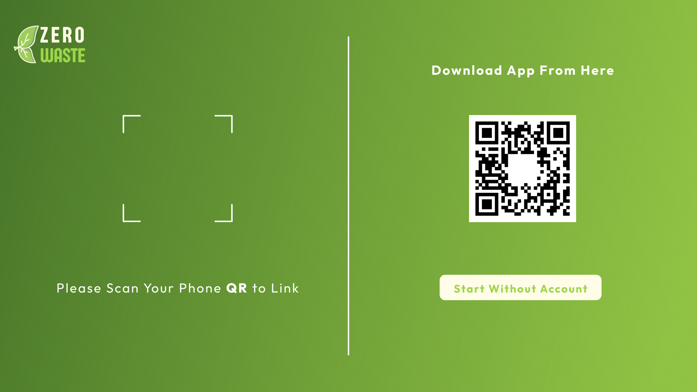
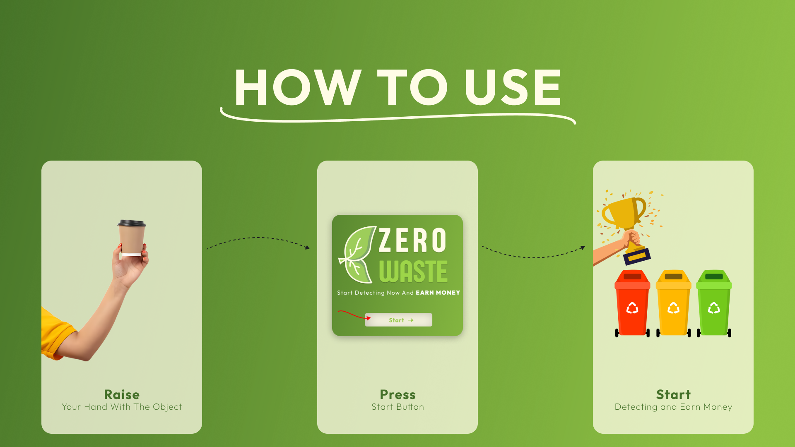
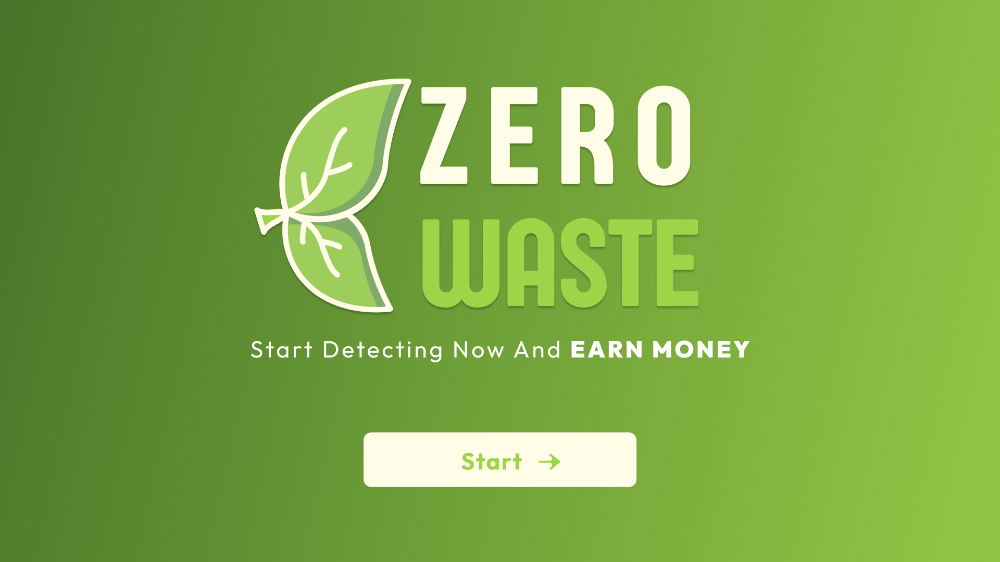
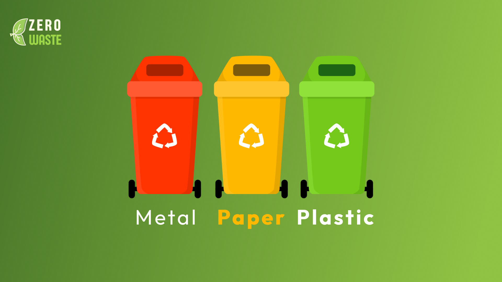
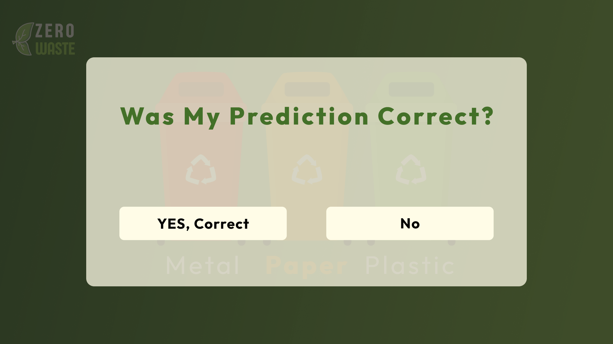
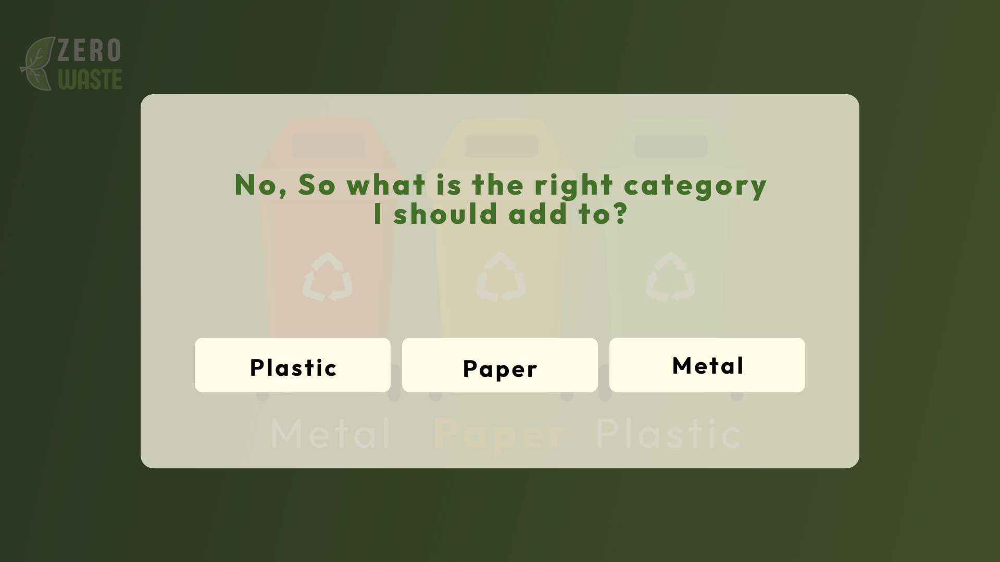
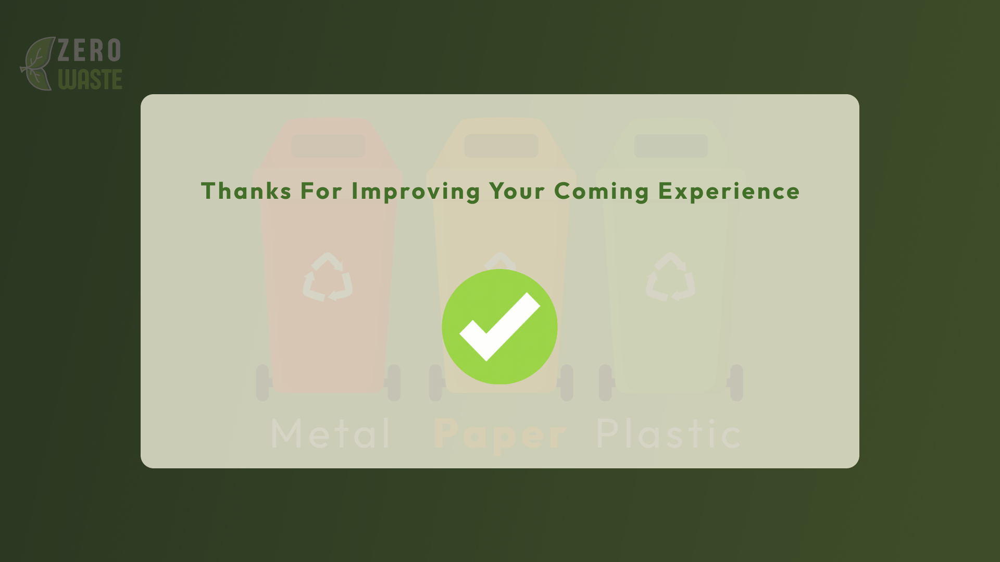
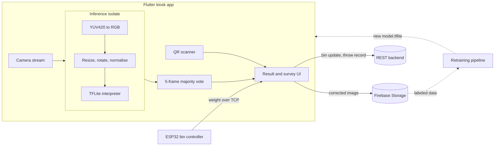
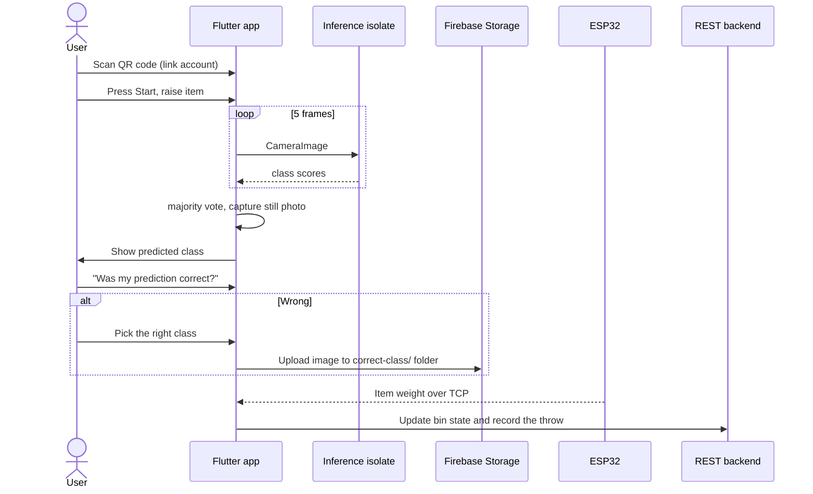

# ♻️ Zero Waste IoT

**A smart waste bin that sees what you throw, sorts it, and rewards you for it.**

Zero Waste IoT is the Flutter kiosk app for an ESP32-powered smart bin. A camera watches the user, an on-device TensorFlow Lite model classifies the item as **metal, paper or plastic**, and the app talks to a hardware controller, a REST backend and Firebase. Users link their account by scanning a QR code and earn points for every item they sort correctly. Every wrong prediction the user corrects becomes a labeled training image for the next model version.


---

## Highlights

| Area | What it does |
| --- | --- |
| **On-device ML** | TFLite image classifier (3 classes) running fully offline, with hardware delegates: XNNPACK on Android. |
| **Non-blocking inference** | Inference runs in a long-lived background **Dart isolate**. The UI thread never does tensor work, so the camera preview stays smooth. |
| **Real-time camera pipeline** | Live `CameraImage` stream, a hand-written YUV420 → RGB converter, resize, rotation fix and normalisation, all in the isolate. |
| **Prediction stabilisation** | Frames are classified one at a time with back-pressure (frames that arrive while one is in flight are dropped). The final label is a **majority vote over 5 frames**, not a single noisy guess. |
| **Human-in-the-loop learning** | A "Was my prediction correct?" flow uploads the captured image to Firebase Storage under the **correct** class folder, building a labeled dataset for retraining. |
| **Hardware integration** | A TCP socket to the ESP32 receives the measured weight after the item drops, which drives the bin update. |
| **Cloud and identity** | QR-code account linking (ZXing) plus a Dio REST client with token auth to update bin fill state and record throws. |
| **Kiosk UI** | 1920×1080 design implemented from Figma, with a responsive helper layer. |

---

## Screens

### 1. Linking account
Scan the QR code with your phone to link your account, download the app, or start without an account.



### 2. How to use
Raise your hand with the object, press Start, then start detecting and earn money.



### 3. Main screen


### 4. Output
The predicted category is shown as Metal, Paper or Plastic.



### 5. Prediction survey
The user confirms whether the prediction was correct.



### 6. Correct the category
If the prediction was wrong, the user picks the right category. The corrected image is saved to Firebase Storage under the chosen category folder (`plastic/`, `paper/` or `metal/`) and collected to retrain and improve the ML model.



### 7. Survey done


---

## System architecture



### End-to-end flow



---

## Technical deep dive

### 1. Inference off the UI thread
[isolate_inference.dart](lib/helper/isolate_inference.dart) spawns one long-lived isolate and keeps a `SendPort` to it. Each request carries the interpreter's **native memory address** (`interpreter.address`). The isolate rebuilds the interpreter with `Interpreter.fromAddress(...)`, so the ~10 MB model is loaded once and shared without copying or re-initialising it per frame. Results come back over a per-request `ReceivePort`.

### 2. Camera frame to tensor
[image_utils.dart](lib/shared/helpers/camera/image_utils.dart) converts raw camera planes to RGB by hand, handling the platform formats:
- **YUV420 (Android):** honours row and pixel strides per plane and upsamples the subsampled chroma channels, using integer-friendly BT.601 coefficients.
- **BGRA8888 (iOS):** maps directly through `ChannelOrder.bgra`.

The frame is then resized to the model's input shape, read from the tensor itself rather than hard-coded. It is rotated 90° on Android (sensor orientation), and each channel is normalised to `[0, 1]` before building the `[1, H, W, 3]` input tensor.

### 3. Hardware acceleration
[image_classification_helper.dart](lib/helper/image_classification_helper.dart) picks the delegate per platform: **XNNPACK** (optimised CPU kernels) on Android and the **Metal GPU delegate** on iOS. The GPU delegate for Android is deliberately left off because it is unreliable on emulators.

### 4. Reliable classification on a noisy stream
A single frame of a moving hand holding an object is unreliable, so the app:
1. **Drops frames under load.** An `_isProcessing` guard skips frames that arrive while one is being classified, which keeps latency bounded and memory flat.
2. **Takes the argmax of each of 5 frames**, then returns the **mode** of those labels (`vote()` in [classification_screen.dart](lib/modules/classification_screen.dart)).
3. **Captures a still photo at decision time**, so the image uploaded for retraining matches the moment of prediction.

### 5. Closing the ML loop (data flywheel)
The feedback flow in [result_screen.dart](lib/modules/result_screen/result_screen.dart) turns user corrections into training data. `uploadImage()` writes the image to `plastic/`, `paper/` or `metal/` in Firebase Storage. Folder-per-class is the layout most training pipelines already expect, so the bucket can be pulled straight into a fine-tuning run.

### 6. IoT link to the ESP32
[socket_helper.dart](lib/shared/helpers/socket_helper.dart) holds a long-lived TCP `Socket` to the ESP32. When the controller reports the item's weight, the handler maps the predicted class to its bin and triggers the backend update in [logic.dart](lib/modules/result_screen/logic.dart): it updates the bin's current weight and full/not-full state, then records the throw for the user.

### 7. Identity without typing
[home_screen.dart](lib/modules/home_screen.dart) uses the front camera with `flutter_zxing` to scan the QR code shown in the mobile app and link the session to a user account. There are no keyboards on a public kiosk, and there is a guest path for anonymous use.

### 8. Architecture and state
- **State management:** `flutter_bloc` / `Cubit` with a global `BlocObserver` for lifecycle logging.
- **Networking:** a `Dio` wrapper with a shared base URL and auth headers.
- **Structure:** feature screens under `lib/modules`, cross-cutting code (helpers, theme, responsive utilities, assets) under `lib/shared`, and ML under `lib/helper`.
- **Responsive layer:** `responsive_helper` and a screen-size enum, to adapt the kiosk layout.
- **Type-safe assets:** asset constants are generated via `flutter_assets`.

---

## Tech stack

| Layer | Technology |
| --- | --- |
| App | Flutter, Dart (≥ 3.4.3) |
| ML | TensorFlow Lite (`tflite_flutter`), `image` for preprocessing |
| Vision input | `camera`, `flutter_zxing` (QR) |
| State | `bloc`, `flutter_bloc` |
| Backend | REST via `dio`, Firebase (`firebase_core`, `firebase_storage`) |
| Hardware | ESP32 over TCP sockets (`dart:io`) |
| UI | Material 3, `flutter_svg`, `smooth_page_indicator`, Outfit font |

---

## Project structure

```
lib/
├── main.dart                     # Firebase, camera, sockets, Bloc bootstrap
├── helper/
│   ├── image_classification_helper.dart   # model and labels loading, delegates
│   └── isolate_inference.dart             # background isolate and preprocessing
├── modules/
│   ├── home_screen.dart          # QR account linking
│   ├── how_to_use_screen.dart    # onboarding
│   ├── classification_screen.dart# live camera, frame voting
│   └── result_screen/            # result, survey, Firebase upload, bin logic
└── shared/
    ├── helpers/                  # camera, socket, navigation, responsive
    ├── data/dio_helper.dart      # REST client
    ├── cubit/                    # app state
    └── themes/                   # colours and typography
assets/
├── ml/model.tflite, labels.txt   # metal, paper, plastic
└── images, icons, fonts
```

---
